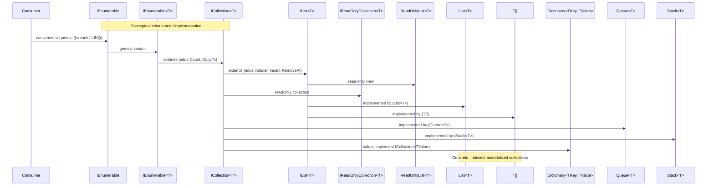

# Collection inheritance — Sequence Diagram

This sequence diagram shows the high-level inheritance/implementation relationships between common .NET collection interfaces and some concrete types.

Notes:
- This is a sequence-style representation to visualize relationships; consider a class diagram for strict inheritance layout.
